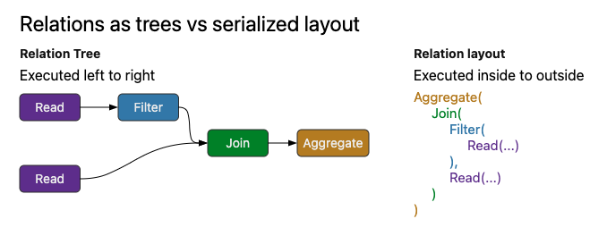

## Agenda: 20250311

- TS2PC Updates
- Sheng: `OTF2` and `TraceEvent` Updates
- What's next?
  - Realtime views
  - Quick discussion on Substrait

## TS2PC (Timestep-Linked 2PC) v2

- "At `ts`", CTL will send commands for `ts+X` (`X=2`)
  - "At `ts`" ~ CTL has last seen `ts`
- TS2PC is not a function of command, for most commands
  - Except `GLOBAL_PAUSE` and `GLOBAL_RESUME`

. . .

- `GLOBAL_PAUSE` stops the simulation
  - `GLOBAL_RESUME` will not get applied until `ts+X`
  - Deadlock!

. . .

- Another obs: `GLOBAL_PAUSE` creates a synchronous state
  - In sync state, commands can be applied immediately

. . .

  - Still need to preserve correctness, ordering etc

## TS2PC v2: Implementation

- Much simpler, uses one hook (`PostTimestepAdvance()`)
  - `PreTimestepAdvance()` unused for now

. . .

- Inner code is fully non-blocking
  - Returns 0 to advance, 1 to block
  - Outer hook will multiplex other tasks, call again
  - Does not need threads

. . .

- `GLOBAL_PAUSE` creates block-sync state
  - All commands are applied immediately, in `txnseq` order
  - `GLOBAL_RESUME` ends block-sync

. . .

## Current Status

- Aggregation overlay exists
  - Overlay supports mutiple aggregators, SQL only on single

. . .

- MPI-side interfaces for schemas and probes exists

. . .

- Core TS2PC infra exists
  - TS2PC for probes exists
  - TS2PC for dynamic queries: TODO
  - TS2PC for online tuning: TODO

. . .

- TUI exists

. . .

- Immediate next steps:
  - How to visualize telemetry?
  - Option 1: export slice to trace
  - Option 2: real-time views

. . .

- After: distributed queries

## Realtime Views: Challenge and Ideas

- We have a highly programmable observability system
- Visualization is a function of current query

. . .

- Persisting telemetry via Parquet: implemented-ish
  - Can be used for offline analysis

. . .

- Unclear how to incorporate a Grafana-like frontend
  - Grafana does not understand timesteps
  - Supports plugins, thinking about how to write one

## Misc: Substrait for SQL

- Substrait: (emerging) intermediate representation for SQL
- Advantage: may not need Datafusion/Rust on most nodes

. . .

- Apache Acero: execution engine in `arrow-cpp`
  - Given an Arrow table + Substrait plan, can execute

. . .

- Still need datafusion for distributed query planning
  - (At a head node or something)
. . .
- May have teething issues

. . .

